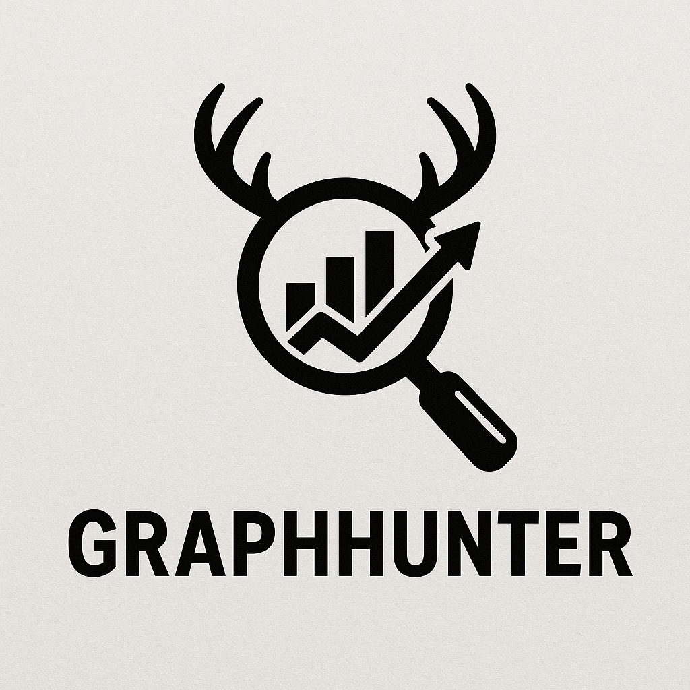

# GraphHunter

---

<!-- Centered logo: replace `images/graphhunter-logo.png` with your logo path (PNG/SVG). 
     Adjust width as needed. GitHub README supports HTML tags for fine control. -->

<p align="center">
  
</p>

---


## What is GraphHunter?

**GraphHunter** is a Microsoft Entra ID (Azure AD) reconnaissance and intelligence tool built around the modern **Microsoft Graph API**.  
It helps security professionals, red teamers, and IAM analysts explore and analyze Entra ID tenants through a clean, interactive web interface.

Unlike traditional static enumeration tools, GraphHunter combines **structured directory data** with **local AI-assisted querying** powered by **Llama via Ollama** — allowing you to ask natural-language questions like:

> “Who are the global administrators?”  
> “List all applications without owners.”  
> “Show me all users in the conditional access admin role.”

Everything runs locally — **no cloud dependencies, no data leaks, no telemetry.**

---

## Key Capabilities

### Unified Tenant Enumeration
- Enumerates all core Entra ID objects:
  - **Users**
  - **Groups**
  - **Applications**
  - **Service Principals**
  - **Directory Roles**
  - **Devices**
  - **Administrative Units**
- Fetches using Microsoft Graph API endpoints (`https://graph.microsoft.com/v1.0`).

### Interactive Web Dashboard
- Clean Flask-based web UI for browsing and searching directory objects.  
- “Details” view shows linked relationships like:
  - User → Group Membership → Directory Role → Owned Applications.
- Displays **both names and UPNs/emails** for clear correlation.


### Local AI Integration (Experimental)
- Connects to **Ollama** and runs **Llama 3.1 (8B)** locally.
- Lets you query your data in natural language — all context stays on your machine.
- Example prompts:
  - “Show users with MFA disabled.”
  - “Which applications are owned by global admins?”
  - “List inactive service principals.”


---

## Why Use GraphHunter?

| Reason | Description |
|--------|--------------|
| **Modern Graph API Support** | Fully migrated from deprecated Azure AD Graph — future-proof. |
| **Deep Directory Insight** | Explore relationships between users, roles, and applications visually. |
| **Fast and Local** | No cloud dependencies — instant responses after prefetch. |
| **Privacy-First** | Keeps all Graph data local; perfect for red teaming or internal audits. |
| **AI-Assisted Analysis** | Ask questions in plain English, powered by Llama3.1 via Ollama. |
| **Lightweight & Portable** | Single Python script + web UI — no complex setup. |
| **Ideal For** | Cloud Security Consultants, IAM Analysts, Red/Blue Teams, and Researchers. |

---

## Installation

Follow these steps to install and run **GraphHunter** locally.

---

### 1. Clone the Repository
```bash
git clone https://github.com/<your-username>/GraphHunter.git
cd GraphHunter
```

### 2. Create and Activate Virtual Environment

It’s recommended to use a Python virtual environment to keep dependencies isolated.
```bash
# Create virtual environment
python3 -m venv venv

# Activate it
source venv/bin/activate       # Linux / macOS
# OR
venv\Scripts\activate          # Windows PowerShell
```
### 3. Install Python Dependencies

All required dependencies are listed in requirements.txt.
```bash
pip install --upgrade pip
pip install -r requirements.txt
```

### 4. (Optional) Install Ollama for Local AI

If you want to use local AI querying with Llama3.1, install Ollama
.

#### Linux / macOS:
```bash
curl -fsSL https://ollama.com/install.sh | sh
```
#### Windows:

Download and install Ollama from:
👉 https://ollama.com/download

#### Then pull the model:
```bash
ollama pull llama3.1:8b
```

### 5. Run GraphHunter

#### Start the web UI using your Microsoft Graph API token.
```bash
python3 script.py --token <GRAPH_TOKEN> --serve
```

#### Access the interface at:
👉 http://127.0.0.1:5000/
(or your configured host/port)

---


## Command-Line Options (actual)

The following options reflect the exact CLI output from `python3 script.py -h` for **GraphHunter**.

usage: graphhunter [-h] [--token TOKEN] [--serve] [--host HOST] [--port PORT] [--no-open] [--ai AI] [--model MODEL] [--top-k TOP_K] [--refresh] [--redact]


### Options

| Flag | Description | Example |
|------|-------------|---------|
| `-h`, `--help` | Show help and exit. | `python3 script.py -h` |
| `--token <TOKEN>` | Microsoft Graph API Bearer token. If omitted you will be prompted. Required for fetching tenant data. | `--token eyJ...` |
| `--serve` | Start the local Flask web UI (will open browser unless `--no-open` is provided). | `--serve` |
| `--host <HOST>` | Host/address to bind the web server to. Default: `127.0.0.1`. | `--host 0.0.0.0` |
| `--port <PORT>` | Port for the web server. Default: `5000`. | `--port 1777` |
| `--no-open` | Do not automatically open the browser when starting the UI. | `--serve --no-open` |
| `--ai <QUERY>` | One-shot AI query from the CLI (bypasses UI AI panel). Pass the question text as a single argument. | `--ai "list global administrators"` |
| `--model <MODEL>` | Specify the Ollama/local model to use for AI queries. Default typically `llama3.1:8b` (change as appropriate). | `--model llama3.1:8b` |
| `--top-k <N>` | Number of top context items (or results) to include for AI queries — controls how much context is injected. | `--top-k 10` |
| `--refresh` | Force a refresh / re-fetch of data from Microsoft Graph (bypasses cache). Useful when data changed. | `--refresh` |
| `--redact` | Redact emails / UPNs in AI output and UI views (hides sensitive identifiers). | `--redact` |

---

### Example commands

#### Start the web UI on default host/port (prompts for token if not passed)
```bash
python3 script.py --serve
```
#### Start UI on port 1777, do not open browser, and use a token
```bash
python3 script.py --serve --port 1777 --no-open --token "<GRAPH_TOKEN>"
```
#### One-shot CLI AI query (uses local model)
```bash
python3 script.py --token "<GRAPH_TOKEN>" --ai "Who are the global administrators?" --model "llama3.1:8b" --top-k 8
```
#### Force-refresh data and redact PII in outputs
```bash
python3 script.py --token "<GRAPH_TOKEN>" --serve --refresh --redact
```
---

## Sample Output

Below are example screenshots showing GraphHunter in action.

---

### GraphHunter Web Portal

The web interface provides an intuitive dashboard to explore your Microsoft Entra ID tenant data.  
It displays users, groups, applications, service principals, roles, and more — all organized and searchable.


.png)
.png)
<sub>*Example: Interactive dashboard showing users, directory roles, and applications in a unified view.*</sub>

---

### Local AI Query (via Ollama)

GraphHunter integrates with **Ollama + Llama3.1**, enabling you to ask natural language questions about your tenant data directly in the browser.

Example query:
> “Who are the global administrators in this tenant?”

Example output:

.png)
<sub>*AI panel responding locally using your tenant data — private, offline, and context-aware.*</sub>

---

> 🧩 *All processing and reasoning happen locally — no cloud APIs or external calls are made. Your data and tokens stay fully under your control.*
---

## Feedback & Contributions

We welcome ideas, feature requests, and contributions from the community!  
If you’d like to improve **GraphHunter**, please feel free to:

- **Open an Issue** — Report bugs, suggest features, or request enhancements.
- **Submit a Pull Request** — Fork the repo, make your changes, and send a PR.
- **Share Ideas** — Help shape new AI-driven or visualization features.
- **Discuss Improvements** — Join conversations about context building, UI/UX, and AI integrations.

> Contributions are appreciated — whether it’s code, documentation, testing, or just thoughtful feedback.  
> Together, we can make GraphHunter even more intelligent, stable, and useful for the community.

---

## ⚠️ Disclaimer

**GraphHunter** is developed for **authorized security research, internal analysis, and educational purposes only.**

- Do **not** use this tool against tenants, environments, or organizations without explicit written permission.
- The author and contributors are **not responsible** for misuse, data loss, or any damages caused by improper use.
- By using this tool, you agree to comply with all applicable laws, ethical guidelines, and organizational policies.

> 🧩 GraphHunter is intended to **assist legitimate cloud security investigations** —  
> not to exploit, harm, or disrupt any systems or networks.

---


